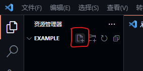
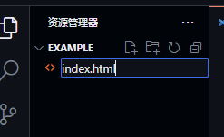
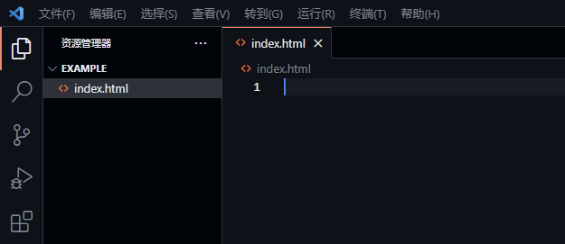
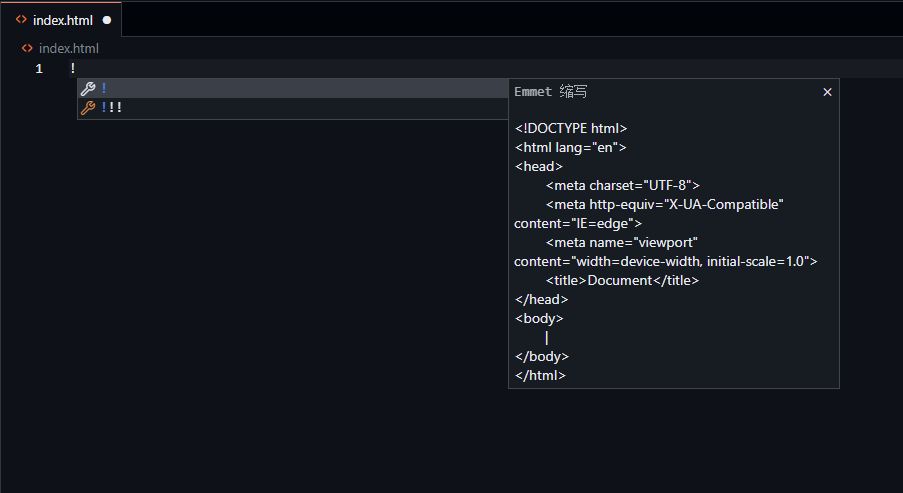
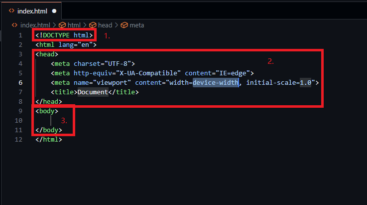

# HTML 语法

HTML(HyperText Markup Language)，即超文本标记语言，是一种用于创建网页的标准标记语言。

所有网页都是基于HTML创建和编写的，因此，学习网页开发就必须首先学习HTML。

### 创建你的第一个HTML文件

1. **首先，在VSCode中点击“创建文件”**



2. **接着，在文件名的输入框中输入`index.html`**

!> `.html`是文件后缀，不可缺少！

其中，`index`是“索引”的意思。在网页开发中，`index`意味着这个网页文件将被作为整个文件夹的默认网页。

如：访问地址`https://example.com/folder/`，就等效于`https://example.com/folder/index.html`



3. **按下Enter键后，网页创建成功！**



### 网页结构

在编辑器窗口中输入`!`(英文模式)，接着按下Enter键，一个基本的网页结构就生成好了。





我们可以看到，网页结构大致分为3部分

1. `<!DOCTYPE html>`：声明，固定写法

2. `<head>`：网页的头部，用于声明页面标题、引入样式表文件、引入JS文件等

3. `<body>`：网页的身体，用于声明页面主体内容，有时还可引入JS文件

### 元素与标签

网页是由许多元素(Element)构成的，而这些元素是通过标签(Tag)来标记的。其中，标签还分为“单标签”与“双标签”。

准确地说，元素是对构成网页对象的统称，而标签就是那些被`<`和`>`包起来的对象，如：`<head>` `<body>` `<table>` 等等。

我们以下面的元素为例，来看看元素中包含什么要素：

```html
<div id="welcome">Hello World</div>
```

1. `div`：标签

2. `id="welcome"`：该元素的属性，一个元素中可以含有多个属性

3. `Hello World`：该元素的内容，内容可以是文字，也可以是元素

#### 单标签

由单个标签构成的标签就称为“单标签”，如：`<br>` `<hr>` `<meta>` 等等。

单标签中不包含内容，只有属性。

#### 双标签

由一对标签构成的标签就称为“双标签”，如：

```html
<p></p>
```

一般地，双标签中包含起始标签与结束标签。在上面的例子中，`<p>`就是起始标签，`</p>`就是结束标签。
