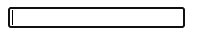

# 表单控件

在HTML中，由`<input>`标签产生了一系列不同的组件，我们称之为**表单控件**。

比如，当我们想要在网页中创建一个输入框，我们可以这么写：

```html
<input type="text">
```

这时候，网页当中就出现了一个输入框：



这时候，我们把`type`属性的值改为`checkbox`，再打开网页看看效果：


我们可以看到，输入框变成了复选框。

这样一来，我们就可以知道： **`<input>`标签是单标签，其中的`type`属性指定了它的类型。**

接下来，我们来认识一些`<input>`的类型（上面出现的`text`和`checkbox`类型就不介绍了）。

### 按钮

```html
<input type="button" value="我是按钮">
```

其中，`value`属性为按钮上显示的文字。

### 颜色选择器

```html
<input type="color">
```

### 日期选择器

```html
<input type="date">
```

### 文件选择器

```html
<input type="file" accept="image/png">
```

其中，`accept`属性为文件选择器所接受的文件类型，属性值需填写[MIME类型](https://baike.baidu.com/item/MIME/2900607)。

上面的用例中，`accept="image/png"`意思就是只接受`png`类型的图片文件。

### 数字选择器

```html
<input type="number">
```

### 密码输入框

```html
<input type="password">
```

密码输入框与普通输入框的区别在于密码输入框中的内容全部以`*`表示。

### 单选框

```html
<input type="radio">
```

### 滑动条

```html
<input type="range">
```

### 隐藏

```html
<input type="hidden">
```

## 总结

在这篇教程中，我们认识了`<input>`这个标签，而在HTML中有许多不同的标签等着你来认识。

你可以访问[MDN 文档](https://developer.mozilla.org/zh-CN/docs/Web/HTML)来详细了解这些标签！
