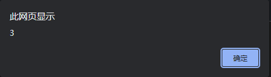
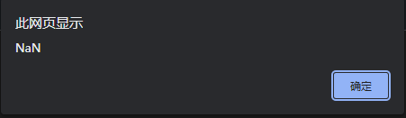

# 什么是 JavaScript?

**JavaScript**是一种脚本，一门编程语言，它可以在网页上实现复杂的功能，网页展现给你的不再是简单的静态信息，而是实时的内容更新，交互式的地图，2D/3D 动画，滚动播放的视频等等。


- **HTML**是一种标记语言，用来结构化我们的网页内容并赋予内容含义，例如定义段落、标题和数据表，或在页面中嵌入图片和视频。
- **CSS**是一种样式规则语言，可将样式应用于 HTML 内容，例如设置背景颜色和字体，在多个列中布局内容。
- **JavaScript**是一种脚本语言，可以用来创建动态更新的内容、控制多媒体、制作图像动画，等等。

### API

**API**(Application Programming Interfaces)，即应用程序接口，它可以为你的代码提供额外的超能力。

在JS中，API分为**浏览器API**与**第三方API**两大类。

#### 浏览器API

**浏览器API**内建于浏览器内部，不需要任何引用的声明，可以直接调用。它可以通过浏览器实现一些复杂的操作，如：

- **文档对象模型 API**，简称DOM API，可以对HTML文档进行一些操作，如创建、修改或删除某些元素。
- **地理位置 API**，可以用于获取你的地理位置。
- **Canvas API**与**WebGL API**，可以在`<canvas>`元素中绘制图像，许多网页游戏都是基于这个API实现的。
- 不止这些...

#### 第三方API

**第三方API**并不内建于浏览器，需要根据官方文档来使用。如：[新浪微博API](https://open.weibo.com)、[Bilibili API](https://api.bilibili.com)、[Github API](https://api.github.com)、[Hitokoto API](https://hitokoto.cn)

---

### 在网页中引入JavaScript

你可以通过`<script>`双标签来直接在HTML文件中编写内部JS代码，也可以用在`<script>`标签中加入`src`属性来引入外部JS代码。

通常情况下，这两种方式都可在`<head>`与`<body>`中进行，下面是引用的示例：

```html
<!DOCTYPE html>
<html lang="en">
<head>
    <meta charset="UTF-8">
    <meta http-equiv="X-UA-Compatible" content="IE=edge">
    <meta name="viewport" content="width=device-width, initial-scale=1.0">
    <title>Document</title>
    <!-- 1. 使用<script>编写内部JS代码 -->
    <script>
        /* 在此处编写JS */
    </script>
    <!-- 2. 使用<script>引入外部JS代码 -->
    <!-- src属性的值中填写JS文件的路径 -->
    <script src="./example.js"></script>
</head>
<body>
    <!---->
</body>
</html>
```

### 运行次序

```js
var a = 1;
var b = 2;
var c = a + b;

alert(c);
```

上面的代码将弹出一个显示`3`的弹窗，如下图：



但如果我将第三行代码与第二行代码互换会怎样呢?

```js
var a = 1;
var c = a + b;
var b = 2;

alert(c);
```

刷新网页后，我们发现网页上弹出了一个显示“NaN”的弹窗，如下图：



“NaN”的意思是“Not a Number”，显示“NaN”是因为创建`c`变量时调用了`b`变量，而在那时，`b`变量还未被创建。

所以，从上面的例子可以看出，一般情况下，JS代码是由上往下一句一句运行的，代码的顺序不能随意调换。

### 注释

在JS中，你可以通过如下的方式来进行注释：

```js
// 我是注释

/* 我是注释 */
```

它不仅支持单行，也支持多行

```js
/**
 * 我是多行注释
 */
```
