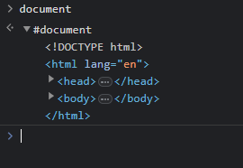

# DOM对象的操作

回顾我们在[第一节](/js-tutorial/1.md)中学过的知识，我们知道，Javascript是可以在HTML中用`<script>`标签引用的。那么，Javascript要如何与HTML网页建立联系呢？这就是我们这一节要探讨的内容。

### DOM对象

**DOM**(Document Object Module)，即文档对象模型，是一个内置在Javascript中的API，一般称为"DOM对象"。我们可以先尝试在浏览器控制台中输入

```js
document
```

之后就可以得到：



是的，我们可以通过 **`document`对象** 直接获得整个网页结构。因此，我们就可以通过它来对网页进行各种操作。

### 获取元素

假设我们有一个如下的元素，那么我们要如何在Javascript中获取这个元素的对象呢？

```html
<span class="text" id="hello">Hello</span>
```

首先，观察这个元素，我们发现这个元素使用了`<span>`标签，且它的class是`text`，它的id是`hello`。那么，我们就可以通过这几个特征来获取这个元素。

#### 以id获取元素

在Javascript中，我们可以这么获取到它：

```js
var element = document.getElementById("hello");
```

由于在整个网页中，每个元素的id都是互不相同的，因此通过id我们只能获取到唯一一个元素。

#### 以class获取元素

在Javascript中，我们还可以这么获取到它：

```js
var elementList = document.getElementsByClassName("text");
```

由于在网页中，元素的class并不是唯一的，所以通过class我们可以获取到一组的元素。因此，`document.getElementsByClassName(...)`这个函数返回的不是元素对象，而是一个由元素对象组成的数组。

?> 如果你能保证你要获取的元素，它的class是唯一的，那么你就可以在`document.getElementsByClassName(...)`后面加一个`[0]`，这样就能直接获取到元素对象了。但是我更推荐使用id来获取元素，因为这样获取到的元素一定是唯一的。

#### 以标签名获取元素

在Javascript中，我们也可以这么获取它：

```js
var elementList = document.getElementsByTagName("span");
```

同样的，由于在网页中可以有多个相同标签名的元素，所以通过标签名我们可以获取到一组的元素。因此，`document.getElementsByTagName(...)`这个函数返回的不是元素对象，而是一个由元素对象组成的数组。

#### 以CSS选择器获取元素

在Javascript中，我们还可以通过选择器的方式获取元素：

```js
var element = document.querySelector("span.text#hello");
```

### 元素的基本操作

获取到元素之后，我们就可以对它进行一些修改或者操作。

比如，我们可以修改元素内部的内容：

```js
element.innerText = "Hello World";
```

运行上面的代码，这个元素将变成：

```html
<span class="text" id="hello">Hello World</span>
```

或者，我们可以修改元素的样式：

```js
element.style.color = "#f00";
```

这样一来，这个元素中的字体就变红了。

?> 元素对象中`style`下的属性名称都和CSS一样，但去除了CSS中的连接符命名(`-`)，而是采用**驼峰命名法**。如：CSS中的`background-color`在Javascript中是`backgroundColor`。

元素对象下还有很多属性和方法可以支持更多样化的元素操作需求，可以去自行探索。
