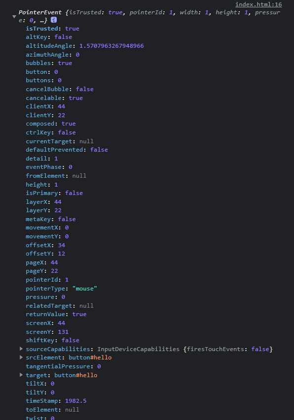

# 事件监听

在[上一节](/js-tutorial/10.md)中，我们学习了如何获取和简单操作元素。这一节中我们要学习的事件监听就属于对元素的操作。

### 什么是事件和监听器？

**事件**(Event)可以被用户行为触发，并且提醒程序做出一些相应的反应；而**监听器**(Listener)就是来告诉程序应该做出什么反应的。

一般地，一个事件可以绑定多个监听器。

### 为元素添加监听器

假设我们有下面的元素：

```html
<button id="hello">Hello World</button>
```

如果我们要为它绑定一个可以监听点击(click)事件的监听器，那么我们首先就需要获取这个元素。

```js
var helloButton = document.getElementById("hello");
```

然后我们有两种方式来绑定监听器：

- **直接修改`onclick`属性**

```js
helloButton.onclick = function() {
    alert("你好世界");
};
```

?> 元素对象下以`on`开头的属性一般都是事件监听器属性，可以自行探索网页中有多少事件。

- **使用`addEventListener`方法绑定监听器**

```js
helloButton.addEventListener("click", function() {
    alert("你好世界");
});
```

这个方法接受两个参数，第一个参数的事件名称，第二个参数是监听器函数。

?> 更推荐使用后者，因为后者可以反复添加多个监听器。

### 事件对象

从上文我们可以知道，监听器是一个函数，那么这个函数能不能传入参数呢？答案是肯定的，它传入的参数就叫做**事件对象**。

我们可以尝试下面的代码：

```js
helloButton.addEventListener("click", function(e) {
    console.log(e); // `e`就是事件对象
});
```

点击按钮之后，就可以在控制台中得到：



这其中包含了这个事件的详细信息，如：点击的位置坐标、点击的元素，等等。
