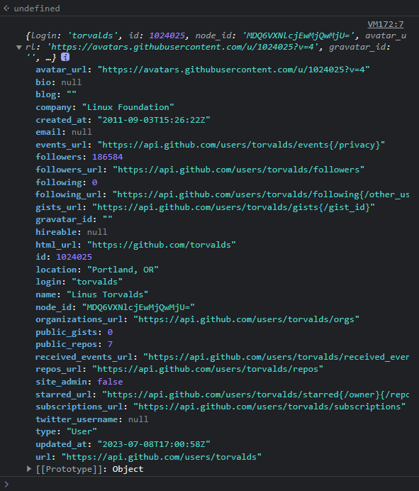

# 用XHR调用WebAPI

**XHR**(XML Http Request)，是Javascript内置的一个类，用于向指定URL发起Http请求，从而达到获取、发送或修改信息的目的。

?> **URL**(Uniform Resource Locator)，统一资源定位符，即我们平常所说的网址，可以用于指定因特网上资源位置。

在这节中，我们将学习如何使用Javascript提供的XHR API。

### Http请求方法

从上面我们知道，Http请求可以获取、发送或修改信息，而控制获取、发送或修改的机制就是Http请求的方法。

Http请求方法主要有下面几种：

- `GET`: 从远程服务器获取信息
- `POST`: 向远程服务器发送信息
- `PUT`: 向远程服务器的指定位置发送信息
- `DELETE`: 删除远程服务器的某个资源
- `OPTIONS`: 获取当前URL所支持的方法
- ...

在开发中，较常用到的是`GET`和`POST`方法。在使用XHR时我们可以指定要使用哪一个方法。

### 发起请求

我们以Github的用户信息API为例，讲解如何用XHR发起一次请求。这个API的URL是`https://api.github.com/users/{user}`，其中`{user}`填的是用户名。

```js
// 获取XHR对象
var xhr = new XMLHttpRequest();
// 开启一个请求 (我们就去获取Linus Torvalds的信息吧)
// 且指定请求方法为GET
xhr.open("GET", "https://api.github.com/users/torvalds");
// 监听收到信息
xhr.onload = function() {
    console.log(xhr.responseText);
};
// 发送这个请求
xhr.send(null);
```

运行上面的代码，我们将得到：


控制台中输出了Http请求获取到的信息，然而这串数据的类型是字符串，我们要将它转换为对象才能进行进一步的读取，把输出的那一句代码改为：

```js
console.log(JSON.parse(xhr.responseText));
```

那么我们就会得到：



这样一来，我们就得到了Linus Torvalds的Github用户信息。

?> **Linus Benedict Torvalds**(1969-)，芬兰赫尔辛基人，著名电脑程序员，毕业于赫尔辛基大学计算机系，是Linux内核的发明人及该计划的合作者。
