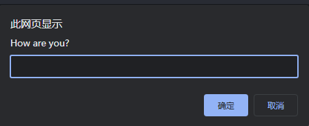
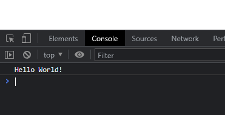

# 认识基本函数

在上一节中，我们知道浏览器中提供了一些内建的API，那么在这一节中，我们就来认识这个内建API中提供的一些基本函数。

### `alert()`

```js
alert("Hello World!");
```

`alert()`的功能是弹出一个弹窗，运行上面的示例代码，我们可以在浏览器中看到如下效果：


### `prompt()`

```js
prompt("How are you?");
```

`prompt()`的功能是弹出一个带输入框的弹窗，运行上面的示例代码，我们可以在浏览器中看到如下效果：



?> 用户在弹窗中输入内容点击“确认”后，`prompt()`函数还会将用户输入的内容作为返回值返回出来。

### `confirm()`

```js
confirm("Hello World!");
```

`confirm()`的功能是弹出一个带“取消”按钮的弹窗，运行上面的示例代码，我们可以在浏览器中看到如下效果：


### `document.write()`

```js
document.write("Hello World!");
```

`document.write()`的功能是在网页中写入一些文字，运行上面的示例代码，我们可以在浏览器中看到如下效果：


### `console.log()`

```js
console.log("Hello World!");
```

`console.log()`的功能是在控制台中输出一些文字，运行上面的示例代码时，我们并没有在浏览器中看到任何效果。但是你可以在网页空白处右键，选择“检查”，进入“Console”栏，这时候，你会看到：


