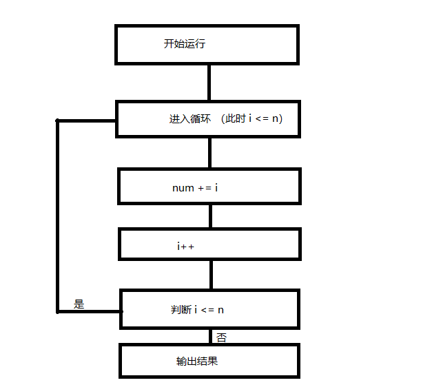

# while循环

假设我们现在需要编写一个程序，这个程序可以计算1加到n的数值，并且不使用高斯求和公式。

例如，我们先编写一个当`n=3`时的程序：

```js
var num = 0;
num += 1;
num += 2;
num += 3;
alert(num); // 6
```

当n=5时：

```js
var num = 0;
num += 1;
num += 2;
num += 3;
num += 4;
num += 5;
alert(num); // 15
```

但如果`n=100`、`n=1000`或`n>1000`呢？显然，上面的方法在此时就不可行了。毕竟我们不可能编写几百行大量重复的代码。

这时候，我们就需要使用**循环**(Loop)来解决这样的问题。

在JS中，循环共分为3种：

- `while`循环
- `do...while`循环 (不常用)
- `for`循环

今天，我们先来学习`while`循环。

---

在上面的例子中，我们不难发现，与变量`num`相加的数都小于等于n，那么我们只需要在加数小于等于n时让它与`num`相加，并且每相加一次就让加数自增1，直到加数大于n再输出结果就可以了。

而while循环顾名思义就是“当...时”，刚好符合我们的需要。因此，我们可以这样编写代码(此时`n=100`)：

```js
var num = 0;
var n = 100;
// 加数
var i = 0;

while(i <= n) {
    num += i;
    i++;
}

alert(num); // 5050
```

我们可以通过如下的流程图来理解上面的代码。



### 用法

`while`后面的括号中需要填入一个逻辑表达式，又称**条件**(Condition)，用以判断是否要运行大括号中的代码。如果该逻辑表达式返回`true`，那么就执行循环；否则，就跳过循环。

跳过的循环如果用上面的例子说，就是当一开始时，`i`就已经小于`n`，那么就会跳过整个`while`语句，直接运行下面的`alert(num);`。

```js
while(condition) {
    statement
}
```
