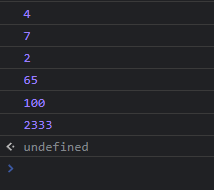
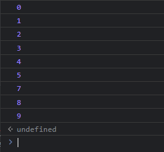

# for循环

在[上一节](/js-tutorial/6.md)中，我们使用while循环实现了一个可以计算1加到n数值的程序。在这一节中，我们将继续深入，优化我们的代码(`n=100`)。

```js
var num = 0;
var n = 100;
// 加数
var i = 0;

while(i <= n) {
    num += i;
    i++;
}

alert(num); // 5050
```

但实际上，我们有一种更优雅简洁的写法来编写这个程序。

我们发现，我们原本的代码中创建了一个变量`i`，并令它的初始值为`0`；循环时判断`i <= n`是否为`true`；循环每执行一次，`i`都会自增1。我们将这三点结合起来，就可以使用for循环来代替while循环，如下面的代码：

```js
var num = 0;
var n = 100;

for(var i = 0; i <= n; i++) {
    num += i;
}

alert(num); // 5050
```

!> 上面变量`i`的作用域仅限for循环体内。

观察代码不难发现，for语句旁的括号中分为三部分，正好对应上文所提到的三点，并且这三部分以`;`为间隔。这样一来，我们的代码就更加简洁易懂了。

代码写出来不仅是要给机器读的，也是要给人看的，因此，代码的可读性就显得非常重要。我们常常说许多大公司内部的源代码是“屎山”代码，其中，可读性之差对“屎山”的贡献就非常大。而有许多情况下，while循环和for循环都可以使用，为了考虑可读性，我们一般使用for循环；但并不代表说不使用while循环，毕竟在有些时候，while循环是胜过for循环的。

> 新手程序员可能认为while循环会不停地求值，一旦while条件的求值结果变成`false`，无论执行到循环中的哪条语句，都会立即终止。虽然没有那么灵活，但while循环仍然不失为一种灵活的循环。<br>——Steve McConnell 《代码大全》

### 数组遍历

假设我们有一个数组：

```js
var arr = [4, 7, 2, 65, 100, 2333];
```

如果我们要将数组中的值一个一个地打印出来，就要使用**遍历**(ForEach)来实现。遍历一般使用for循环，如下：

```js
for(var i = 0; i < arr.length; i++) {
    console.log(arr[i]);
}
```

这将把数组内的所有值打印出来，如图。



上面的代码中，变量`i`表示**索引值**(Index)，使用索引可以在数组中找到特定的值。在for循环中，`i`的数值一次次增加，直到其等于`arr.length - 1`，也就是不超过数组长度。

### 用法

`for`后面的括号中需要在`;`分隔开的三个空中分别填入**初始化表达式**(Initial Expression)、**条件**(Condition)以及**更新表达式**(Increment Expression)。运行时先执行初始化表达式，然后在条件返回`true`的情况下执行循环，循环每执行一次，就执行一次更新表达式来更新初始化表达式中创建的变量。

```js
for([initialExpression]; [condition]; [incrementExpression]) {
    statement
}
```

### `break`

或许你看到这个关键字时就会想到`switch`语句，没错，它在`switch`中就常常被用到。而它在`for`循环中也可以被使用。

从上面的内容我们可以知道，下面的代码运行后将输出0~9这十个数字。

```js
for(let i = 0; i < 10; i++) {
    console.log(i);
}
```

然而，当我将它改成

```js
for(let i = 0; i < 10; i++) {
    if(i === 6) {
        break;
    }
    console.log(i);
}
```

它将不再输出0~9的所有数字，而是输出


这是因为，在这段循环中，程序在`i=6`时使用了`break`将`for`循环直接结束了，因此，≥6的所有数都将不被输出。

从上面的例子中，我们可以很好的看出，`break`可以用于结束整个循环(包括`while`和`for`)。

?> `break`**通常情况下**是在`if`语句中执行的，因为一般程序需要判断是否满足某个条件才将循环结束。下面的`continue`关键字同理。

### `continue`

还是上面的这个例子

```js
for(let i = 0; i < 10; i++) {
    console.log(i);
}
```

将它改为

```js
for(let i = 0; i < 10; i++) {
    if(i === 6) {
        continue;
    }
    console.log(i);
}
```

运行后我们将得到



我们发现，输出的数字中唯独没有`6`这个数字。这是因为在`i=6`时，`if`语句中的`continue`关键字使`for`循环跳过了当前(即`i=6`)的循环，直接进入下一次(即`i=7`)循环，而没有输出`6`。

从上面的例子中，我们可以看出，`continue`是用于跳过当前循环，进入下一次循环的。
